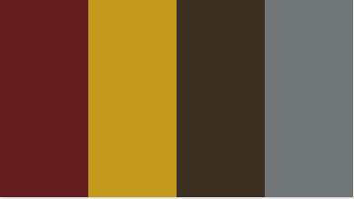

# Mystic Match

Mystic Match is an enchanting card matching adventure where you will unveil the cards in a quest to discover all the magical pairs. Beware, if you dont successfully match them all you might encounter the ominous spell AVADA KEDAVRA!

## UX:

### Site purose

The site purpose is to engage anyone into the game, more so if your a HP fan but anyone can get involved. The idea behind the game is to match the cards as fast as you can in the given time frame and if you fail you get muggled.

### Site goal

The site goal is to engage users into the wizardry world and along the way gain some knowlege and hopefully convert to mystic ways!

### Audience

I hope people of all ages, from 5 to 100 can discover the magical and enchanting journey that Harry Potter offers. My goal is to raise awareness about its universal appeal and recognition across generations.

### Communication

The communication of the page is designed to be easily understandable for any user. It features clear buttons, a user friendly modal pop up and employs easy to read fonts with distinctly displayed colors, aiming for universal accessability.

### Current user goals

The present objective for users is to actively participate, cultivate interest and derive enjoyment throughout their journey.

### New user goals

To be engaged upon arrival of the site and to have fun along the way.

### Future user goals

- Difficulty levels for the user to suit their needs
- Another page for more information on the characters.

## Design:

### Wireframes

Above is the desktop wireframes showing each stage the user will see.

Above is the tablet wireframes showing each stage the user will see.

Above is the mobile wireframes showing each stage the user will see.

### Typography

MedievalSharp was selected for the heading of my page with gothic selected for the rest. All fonts taken from googlefonts.

### Color scheme

My original color theme was intended to match the deathly hallows style darkness, however I had to imrpovise as the buttons just weren't clear enough so I chose to style the buttons in gryffindor color theme.

You can view the website I used for the colors [here](https://www.color-hex.com/color-palette/64222)

### Images

The images used in the website are sourced from various locations which are all documented and credited in the media section. I hold no rights to any images and are only used for educational purposes.

## Features

### Landing Page

For the landing page I chose to hide the game board and have a button the user can click which is linked to a pop up modal  with instructions of how to play. You can view the landing page [Here](assets/documentation/landing-page.PNG). The modal pop up can be viewed [Here](assets/documentation/modal-instructions.PNG).

### Game board

Once the user clicks start game the game board is revealed and the timer starts the countdown. You can view the game board [here](assets/documentation/game-board.PNG)

## Media

- [dumbledore](https://movie-heroes-and-villains.fandom.com/wiki/Albus_Dumbledore)
- [voldemort](https://movie-heroes-and-villains.fandom.com/wiki/Lord_Voldemort?file=Voldemort.jpg)
- [harry](https://neoencyclopedia.fandom.com/wiki/Harry_Potter_(character)?file=HarryPotter5poster.jpg)
- [ron](https://neoencyclopedia.fandom.com/wiki/Ron_Weasley?file=Ron_Weasley_poster.jpg)
- [hermoine](https://neoencyclopedia.fandom.com/wiki/Hermione_Granger?file=Hermione_Granger_poster.jpg)
- [lucius](https://villains.fandom.com/wiki/Lucius_Malfoy?file=Lucius+Malfoy.jpg)
- [dobby](https://harrypotter.fandom.com/wiki/Dobby?file=Dobby.jpg)
