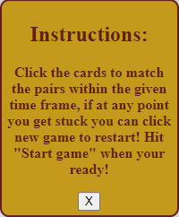

# Mystic Match

Mystic Match is an enchanting card matching adventure where you will unveil the cards in a quest to discover all the magical pairs. Beware, if you dont successfully match them all you might encounter the ominous spell AVADA KEDAVRA!

## UX:

### Site purose

The site purpose is to engage anyone into the game, more so if your a HP fan but anyone can get involved. The idea behind the game is to match the cards as fast as you can in the given time frame and if you fail you get muggled.

### Site goal

The site goal is to engage users into the wizardry world and along the way gain some knowlege and hopefully convert to mystic ways!

### Audience

I hope people of all ages, from 5 to 100 can discover the magical and enchanting journey that Harry Potter offers. My goal is to raise awareness about its universal appeal and recognition across generations.

### Communication

The communication of the page is designed to be easily understandable for any user. It features clear buttons, a user friendly modal pop up and employs easy to read fonts with distinctly displayed colors, aiming for universal accessability.

### Current user goals

The present objective for users is to actively participate, cultivate interest and derive enjoyment throughout their journey.

### New user goals

To be engaged upon arrival of the site and to have fun along the way.

### Future user goals

- Difficulty levels for the user to suit their needs
- Another page for more information on the characters.

## Design:

### Wireframes

Above is the desktop wireframes showing each stage the user will see.

Above is the tablet wireframes showing each stage the user will see.

Above is the mobile wireframes showing each stage the user will see.

### Typography

MedievalSharp was selected for the heading of my page with gothic selected for the rest. All fonts obtained from googlefonts.

### Color scheme

My original color theme was intended to match the deathly hallows style darkness, however I had to imrpovise as the buttons just weren't clear enough so I chose to style the buttons in gryffindor color theme.

You can view the website I used for the colors [here](https://www.color-hex.com/color-palette/64222)

### Images

The images used in the website are sourced from various locations which are all documented and credited in the media section. I hold no rights to any images and are only used for educational purposes.

## Features

### Landing Page

For the landing page I chose to hide the game board and have a button the user can click which is linked to a pop up modal  with instructions of how to play. Here is the landing page along with the pop up modal.

### Game board

Once the user clicks start game the game board is revealed and the timer starts the countdown. 

### Modals

 

Above are 3 modals the player will see in their journey through the game. The first is the instructions modal which pops up when the player clicks How to play, The second is the win modal which pops up if the player is successful, The third is the game over modal.

### Footer

I have also added social media links along with youtube for more viewing pleasure.

## Testing:

During testing I found that the start game button was not working after  new game was clicked, after a while of testing and checking the console it was pointed out to me by my good friend nik that the game state wasn't being logged. So I added a global variable that toggles when the game is started.

I also had an issue with my radial gradient looping through my page instead of creating the look from light grey on the outside to white on the inside, after a few google searches I found that the VH wasnt set creating the radial gradient to loop only the length of my title. Below is the comment I found to fix this.

While doing my lighthouse reports I found that my images did not have alt's. I added the alts using the file names however it was also adding .jpg, I turned to stack overflow to help me with this issue, where I was able to add a line of code that sliced the .jpg off. You can view the thread [Here](https://stackoverflow.com/questions/952924/how-do-i-chop-slice-trim-off-last-character-in-string-using-javascript).
By adding the altForImg + backImg.alt I was able to create the desired alt.

### Manual testing

Below is a table of manual testing carried out by myself.

| Feauture tested | Action     | Outcome               | Result                    |
|-----------------|------------|-----------------------|---------------------------|
|How to play BTN  | Left click | Pop up modal          |Successfully opens modal   |
|Modal close BTN  | Left click | Close Modal           |Successfully close modal   |
|Start game BTN   | Left click | Start's Game          | Successfully Start's game |
|New game BTN     | Left click | Clear's game          | Successfully Clear's game |
|Social links     | Left click | Direct to desired link| Successfully loads link   |

### Validator testing 

- HTML files passed through w3c with no issues found, As shown below.

- Css files passed through w3c with 1 issue found which was a link to fontawesome, this has been corrected as shown below.

- I used Js hint to check my JavaScript code, no errors as shown below. I did however remove all unnecassary semi colon's as it suggested and corrected a typo in my global variable.

### Lighthouse reports

| location | Result                                               |
|----------|------------------------------------------------------|
| Desktop  |  |
| Mobile   |    |

The page has a full house on Desktop and nearly full on Mobile. 

### Browsers & devices tested

- I have tested the sie on Chrome, FireFox, Edge & safari with no issues.
- I tested the site accross multiple device platforms ranging from my Desktop pc to a galaxy fold (Smallest screensize availabe) with no issues or layout errors found.
  
### Responsiveness

While working on this game, I underestimated the complexity of the task. It was only midway through the project that I began to regret my decision not to utilize bootstrap and Jquery. Although I successfully ensured the game's functionality accross various devices, I now realise that opting for libraries like Bootstrap and Jquery could have allowed me to implement a more intricate and sophisticated game.

### Bugs

After my final testing phases, There are no known bugs to date.

## Technologies used:

### languages

- 
- 
- 

### Frameworks, libraries & programs used.

- Photo shop - For the resizing of my images.
- Font Awesome - Too add icons to the page.
- Code Anywhere - Too create my project
- Git hub - To store my repository
- Am I Responsive - To view site on all devices
- Google fonts - For the fonts MedievalSharp and Gothic
- Balsamiq - For my wireframes
- Snipping tool - for all my snippets for readme.

## Deployment

The site was deployed through Github pages, The steps to deploy are as follows:

- In the git hub repository navigate to the settings tab.
- Under the Code and Automation section, select Pages.
- From the sourcedrop-down menu, select the MAIN branch. Then select Save.
- Once the main branch has been selected , the page with autimatically be refreshed with a detailed ribbon to diplay the deployment was successful.
- The live site can be found [here]()

### Content

- [Color Hex](https://www.color-hex.com/color-palette/64222) For my color choices.
- [Font Awesome](https://fontawesome.com/) For my icons.
- [Google fonts](https://fonts.google.com/) For my fonts.

## Media

I do not hold any rights to these images and they are only used for educational purposes.

- [Dumbledore](https://movie-heroes-and-villains.fandom.com/wiki/Albus_Dumbledore)
- [Voldemort](https://movie-heroes-and-villains.fandom.com/wiki/Lord_Voldemort?file=Voldemort.jpg)
- [Harry](https://neoencyclopedia.fandom.com/wiki/Harry_Potter_(character)?file=HarryPotter5poster.jpg)
- [Ron](https://neoencyclopedia.fandom.com/wiki/Ron_Weasley?file=Ron_Weasley_poster.jpg)
- [Hermoine](https://neoencyclopedia.fandom.com/wiki/Hermione_Granger?file=Hermione_Granger_poster.jpg)
- [Lucius](https://villains.fandom.com/wiki/Lucius_Malfoy?file=Lucius+Malfoy.jpg)
- [Dobby](https://harrypotter.fandom.com/wiki/Dobby?file=Dobby.jpg)
- [Luna](https://www.wizardingworld.com/features/seven-reasons-to-love-luna-lovegood)
- [Favicon](https://www.pinterest.co.uk/pin/481955597626287532/)
- [Hp logo](https://www.deviantart.com/sprntrlfan-livvi/art/Harry-Potter-Logo-163055561)

### People

- I would like to thank my mentor [Spencer barriball](https://github.com/5pence) for His support throughout my first and second project has been immense and greatly appreciated.
- I would like to thank my friend [Nicholas Mobey](https://www.linkedin.com/in/nicolas-mobey-79149049) for His support constantly throughout my projects pushing me on when the going gets tough and guiding me where it's neeeded.
- I would like to thank the [CI Tutor support](https://learn.codeinstitute.net/ci_support/level5diplomainwebappdevelopment/tutor) for their ongoing support throughout my projects.
- I would like to also take the time to thank [Code Institute](https://codeinstitute.net/) as a whole, I have faced a very difficult few months in my home life and recieved nothing but support from CI student care and for that I am very greatful.
